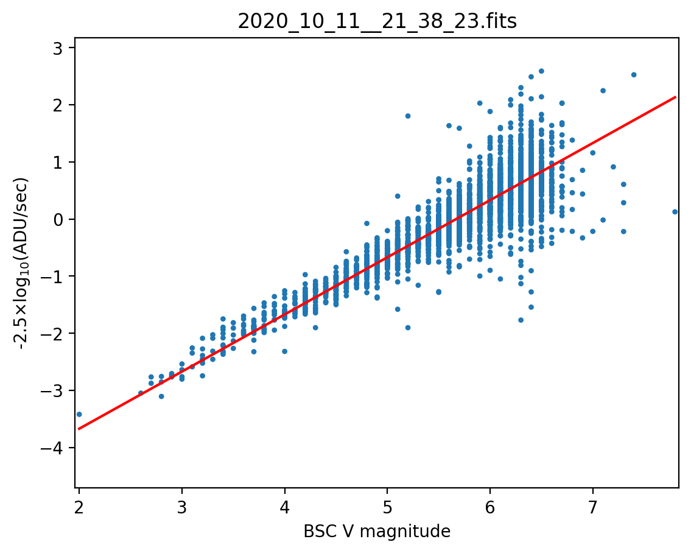
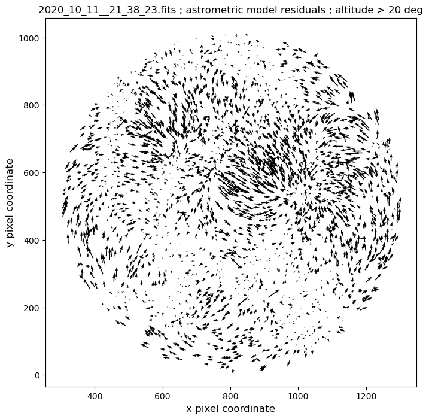
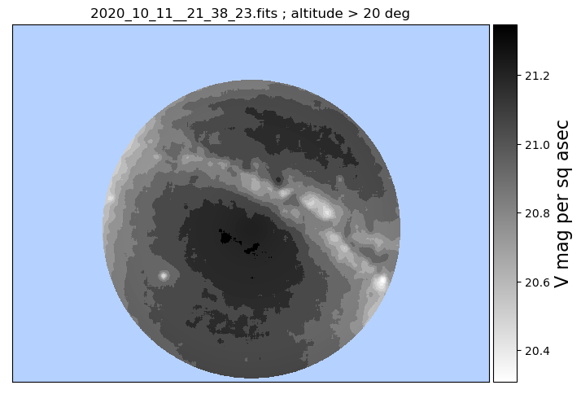

# allsky_camera

A pipeline for processing all-sky camera images.

This all-sky camera reduction/analysis pipeline is implemented in pure Python. It has a relatively small number of dependencies that must be installed.

Here is an example invocation for running the full pipeline:

    python -u /global/homes/a/ameisner/allsky_camera/py/allsky_camera/ac_proc.py /global/cfs/cdirs/desi/users/ameisner/MDM/allsky/2020_10_11__21_38_23.fits --outdir .

This produces, among other output, the following photometry/zeropoint check plot:

The following checkplot of astrometric residuals relative to the static template is also produced:

The following plot of sky brightness in V magnitudes per square arcsecond is also produced:

The list of outputs produced is:

    2020_10_11__21_38_23-cat.fits
    2020_10_11__21_38_23-detrended.fits
    2020_10_11__21_38_23-zp.png
    2020_10_11__21_38_23-quiver.png
    2020_10_11__21_38_23-sbmap.png

* The -cat.fits output is a FITS binary table with the source catalog including measured centroid locations and fluxes.
* The -detrended.fits output is a detrended version of the raw all-sky camera image.
* The -zp.png output is a checkplot showing the all-sky camera photometry and corresponding zeropoint measurement.

Additional output files are also possible via invocation of certain command line options:

* setting `--write_sbmap` will write the surface brightness map as a FITS image with suffix `-sbmap.fits`.
* setting `--oplot_centroids` will create an image rendering with suffix `-detrended.png`.
* setting `--write_healpix` will write HEALPix maps of the photometric zeropoint to a FITS image with suffix `-healpix.fits`.
* setting `--detect_streaks` will write out the list of detected streaks (if any) to a Pickle file with suffix `-streaks.pkl`.

# full help for running the pipeline

    allsky_camera/py/allsky_camera> python ac_proc.py --help
    usage: ac_proc.py [-h] [--outdir OUTDIR] [--dont_write_detrended] [--multiproc MULTIPROC] [--skip_checkplots] [--skip_sbmap] [--write_sbmap] [--force_mp_centroiding]
                      [--dont_write_catalog] [--oplot_centroids] [--write_healpix] [--detect_streaks]
                      fname_in

    run the all-sky camera reduction pipeline on an exposure

    positional arguments:
      fname_in              all-sky camera raw image file name

    optional arguments:
      -h, --help            show this help message and exit
      --outdir OUTDIR       directory to write outputs in
      --dont_write_detrended
                            don't write detrended image
      --multiproc MULTIPROC
                            number of threads for multiprocessing
      --skip_checkplots     don't create checkplots
      --skip_sbmap          don't do sky brightness map
      --write_sbmap         write sky brightness map as FITS image
      --force_mp_centroiding
                            use multiprocessing for recentroiding
      --dont_write_catalog  don't write source catalog FITS file
      --oplot_centroids     checkplot overlaying centroids on detrended image
      --write_healpix       write HEALPix map of photometric zeropoint
      --detect_streaks      run satellite streak detection/cataloging